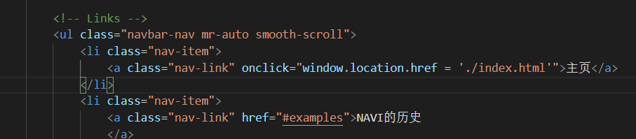
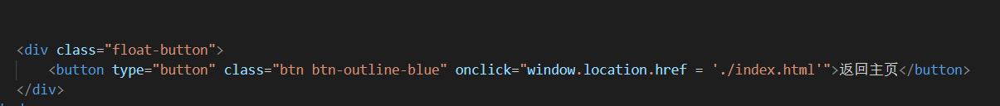
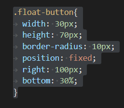
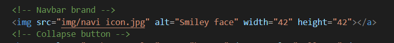

## 做的什么

​	我使用的是MDB框架，主题是我最喜欢的游戏CSGO的战队NAVI的介绍。

## 开发过程

​	首先在棋歌教学网下载了MDB框架的文件。然后按照其中的教学将html的风格确定，然后再使用vs Code写了关于Navi的信息。

## 遇到的问题

​	首先页面之间的跳转问题，然后再遇到了悬浮按钮的问题。

​		

​	最后是图标的问题，在导航栏中放一个navi图标，原本打算点击该图标能跳转到navi的官网，但是出现了问题。

## 如何解决

​	跳转的问题很容易就解决了，在网上搜到了点击事件的实现

​	用onclick事件就能够完成页面的跳转。

​	悬浮按钮也找到了相应的解决方法。

## 未能解决

​	关于点击图标就跳转的问题我没能解决。使用btn类会使得图标不好看，所以最后没能解决。

## 总结

​	本次结课作业使我主动学到了许多，MDB框架得使用也比之前更为熟练，也对html的一些类的用法有了认识。

​	但是有些遗憾的是没有用动态网站写出本次作业。在之后的空闲时间我会努力学习如Angular、Vue框架。
